# Installation Guide

## Prerequisites

The ABAP system must have the following package installed:

- **[ABAP AI tools](https://github.com/christianjianelli/yaai)**

## Installation (SAP Tutorials and Documentation)

- Clone the [ABAP AI tools Cockpit repository](https://github.com/christianjianelli/yaai_cockpit) in Visual Studio Code or in your Business Application Studio development environment. [This tutorial explains how to do it](https://developers.sap.com/tutorials/build-code-simple-git.html).

- Deploy the SAPUI5 application. See [Deploying SAPUI5 Applications to the SAPUI5 ABAP Repository](https://help.sap.com/docs/ABAP_PLATFORM_NEW/468a97775123488ab3345a0c48cadd8f/a560bd6ed4654fd1b338df065d331872.html?locale=en-US).

- As of SAP AS ABAP 7.53, deployment can be done directly from VS Code using the SAP Fiori Tools (https://help.sap.com/docs/SAP_FIORI_tools/17d50220bcd848aa854c9c182d65b699/1b7a3be8d99c45aead90528ef472af37.html?locale=en-US).

## Installation Steps - SAP AS ABAP 7.52 Developer Edition

Here are the steps to clone the ABAP AI tools Cockpit repository using VS Code and upload the app to the ABAP Application Server using the report `/UI5/UI5_REPOSITORY_LOAD`.

### Prerequisites

- [Visual Studio Code](https://code.visualstudio.com/download)
- [SAP Fiori Tools Extension Pack](https://marketplace.visualstudio.com/items?itemName=SAPSE.sap-ux-fiori-tools-extension-pack)

> This tutorial explains how to install VS Code and the SAP Fiori Tools Extension Pack:  
> SAP Tutorial - https://developers.sap.com/tutorials/fiori-tools-vscode-setup.html

### Step 1 - Clone the `ABAP AI tools Cockpit` GitHub Repository

The Visual Studio Code documentation has all the information on how to set up your development environment to work with GitHub in VS Code. It also explains how to clone a GitHub repository.
- [Working with GitHub in VS Code](https://code.visualstudio.com/docs/sourcecontrol/github)

### Step 2 - Upload the `ABAP AI tools Cockpit` SAPUI5 Application to the SAP ABAP Application Server Using the Report `/UI5/UI5_REPOSITORY_LOAD`

1. Create the package `YAAI_COCKPIT`.

2. Run the report `/UI5/UI5_REPOSITORY_LOAD`.

   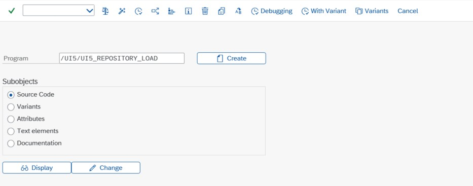

3. Enter `YAAI_COCKPIT` as the name of the SAPUI5 application.

   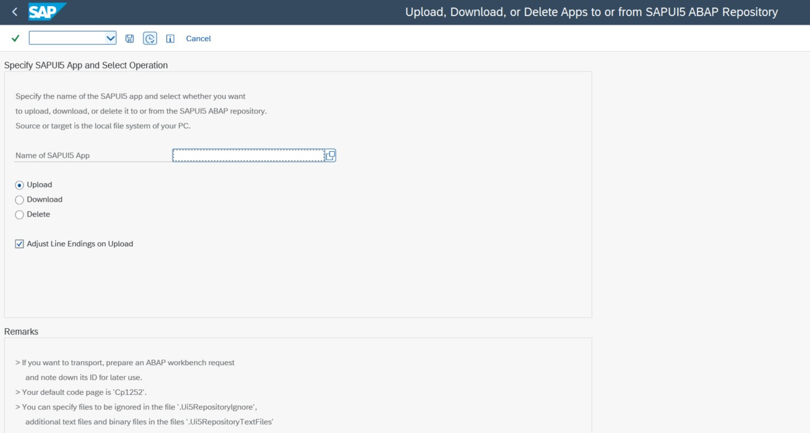

4. Leave the Upload option selected and execute the report.

   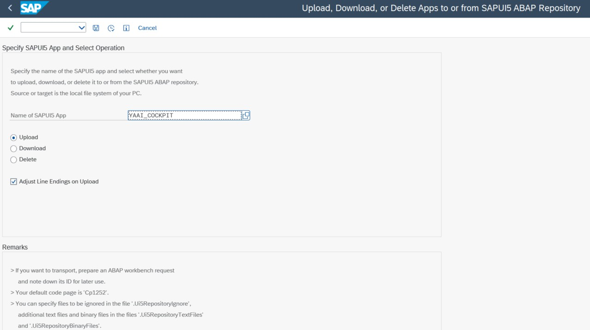

5. A popup window will open for you to select the webapp folder. Navigate to the path where you cloned the repository and select the webapp folder.

   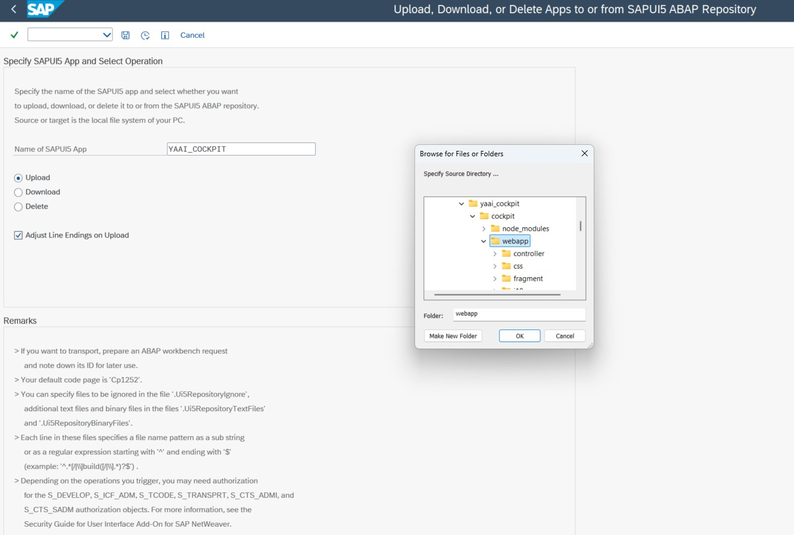

6. A list will be displayed for you to confirm the upload. Scroll to the bottom of the list and click on the green text **[Click here to Upload]**.

   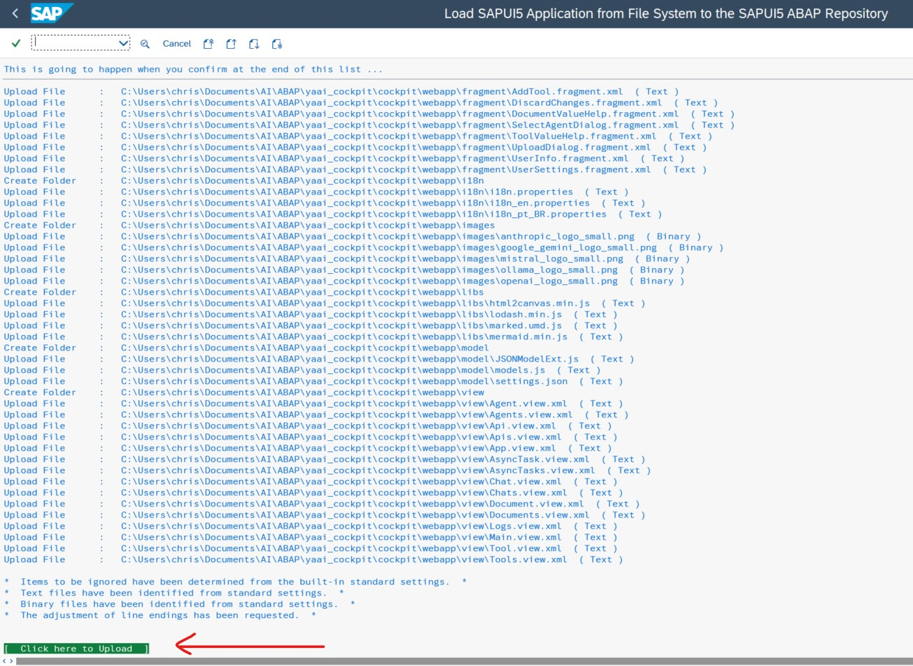

7. A new popup will be displayed for you to enter the description, package (enter YAAI_COCKPIT), transport request and the External Codepage (enter utf-8).

   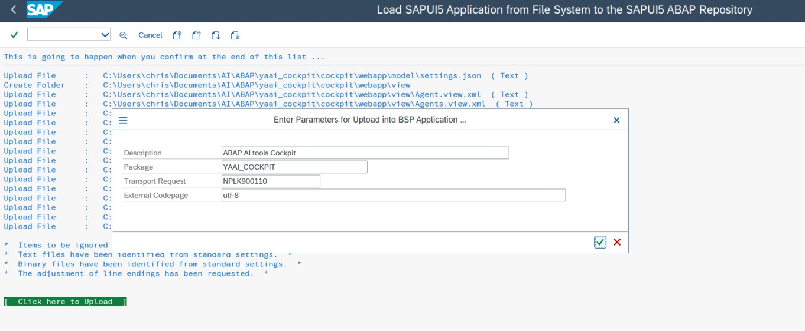

8. Open the package `YAAI_COCKPIT` in the transaction SE80 to check whether the SAPUI5 application YAAI_COCKPIT has been uploaded.

   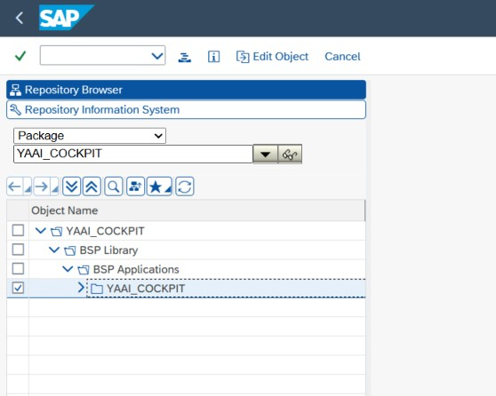

9. Open the SICF transaction and execute (F8).

   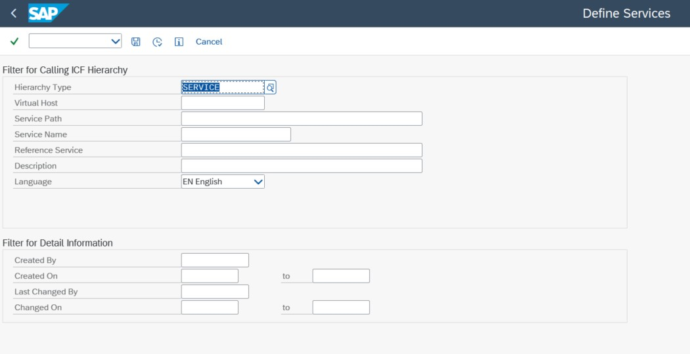

   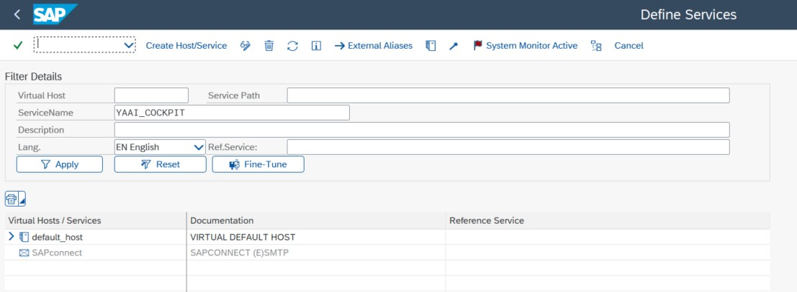

10. Enter `YAAI_COCKPIT` in the `ServiceName` field and press `Apply`.

   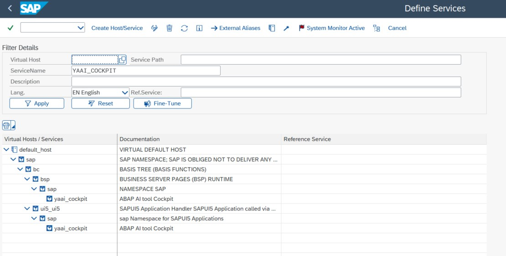

11. Right-click the service `yaai_cockpit` under `ui5_ui5/sap/` and choose `Test Service`.

   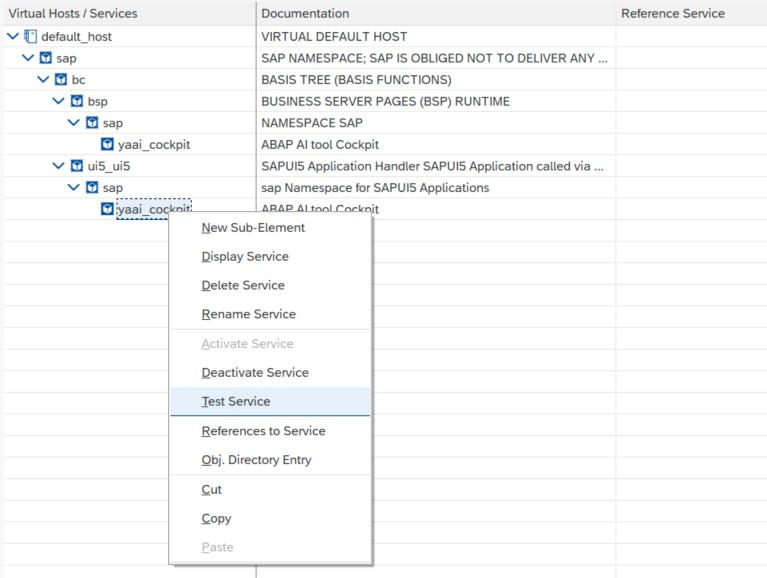

If you have the domain `vhcalnplci.dummy.nodomain` correctly configured in your hosts file, the application should appear in your default browser:

https://vhcalnplci.dummy.nodomain:44300/sap/bc/ui5_ui5/sap/yaai_cockpit/index.html?sap-client=001&sap-language=EN

   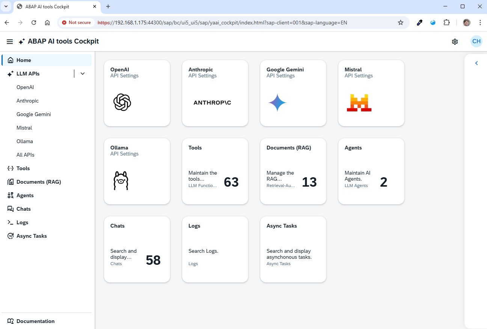

If you don't have the domain `vhcalnplci.dummy.nodomain` configured, your browser will display a message like `This site can't be reached`. In this case, you can replace the domain with your server's IP, as in the example below:

https://192.168.1.202:44300/sap/bc/ui5_ui5/sap/yaai_cockpit/index.html?sap-client=001&sap-language=EN
