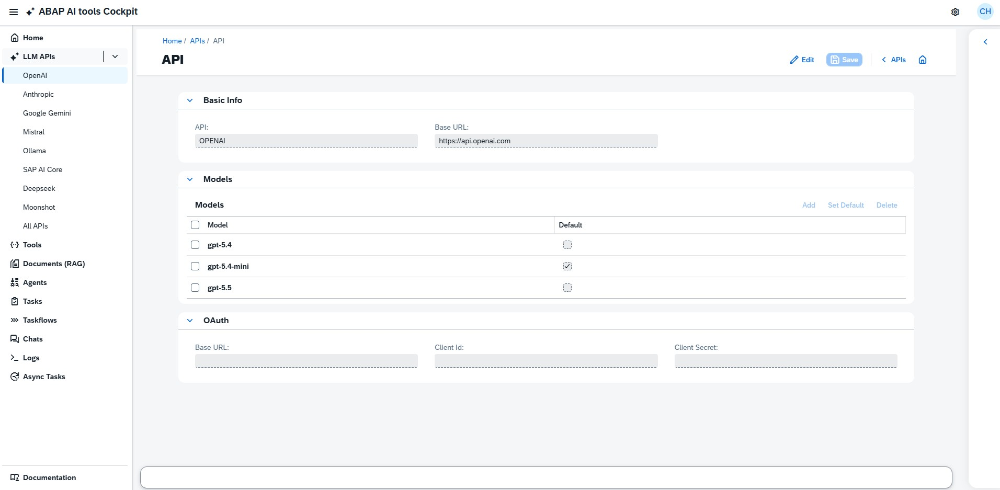
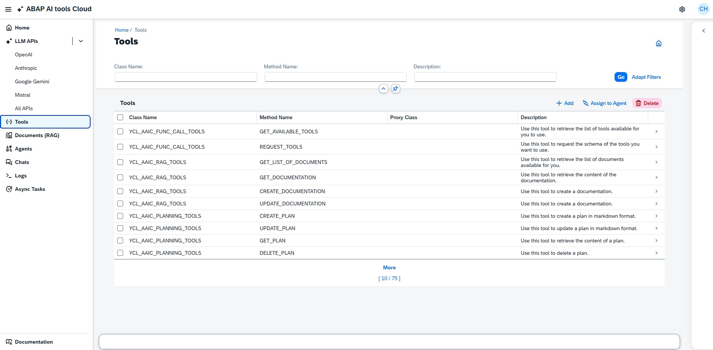
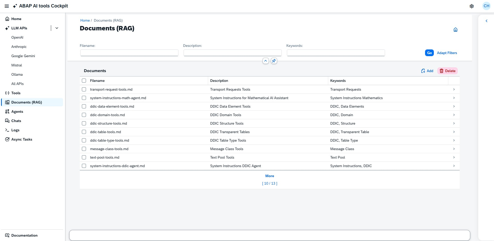
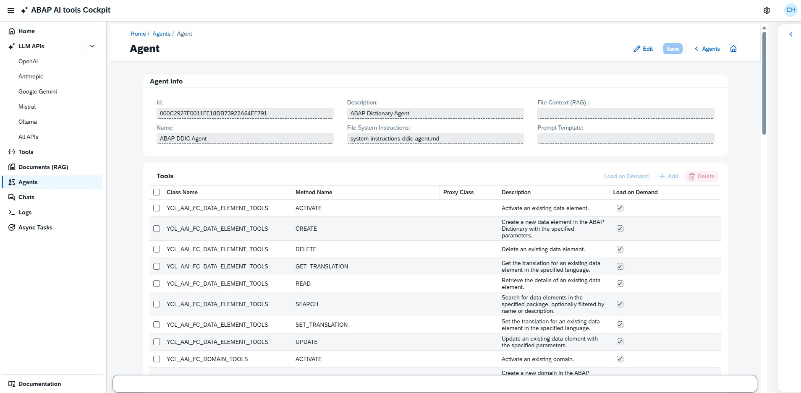
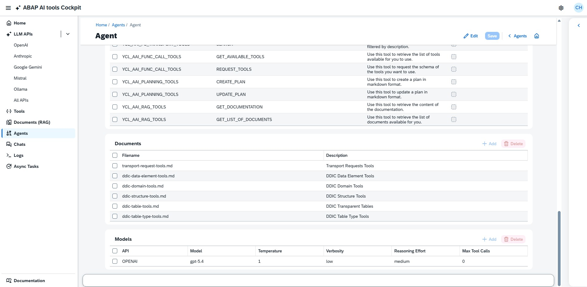
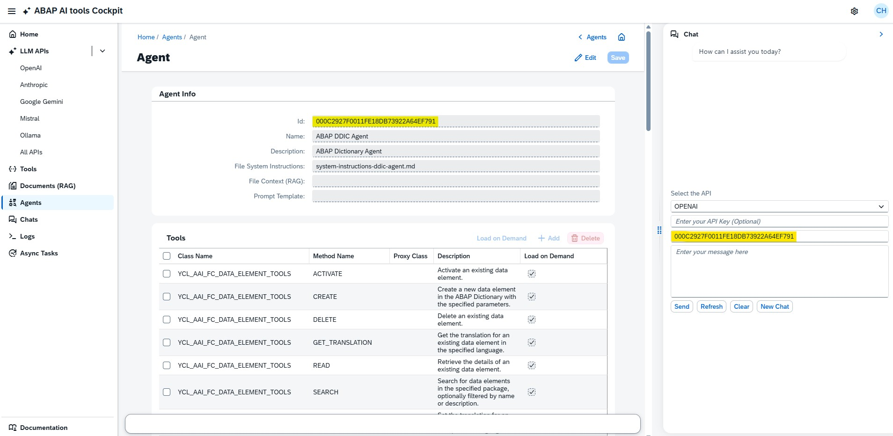
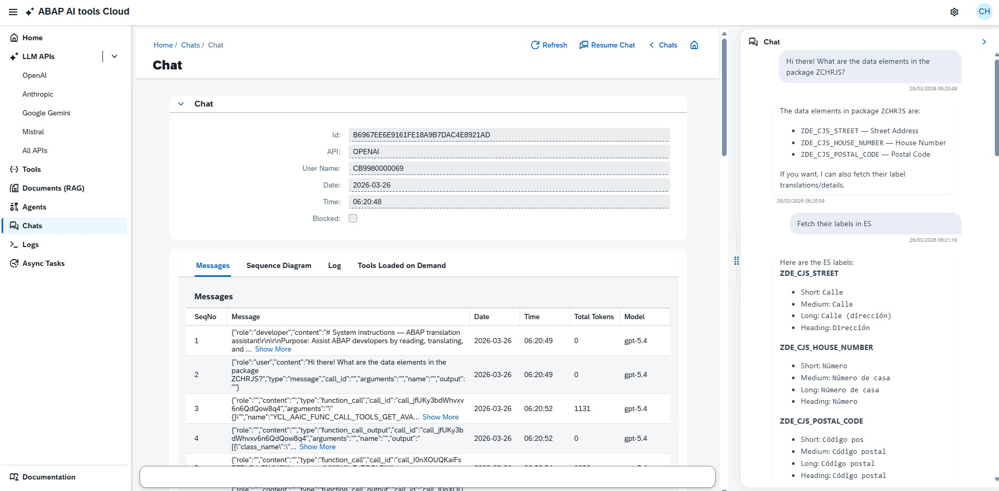
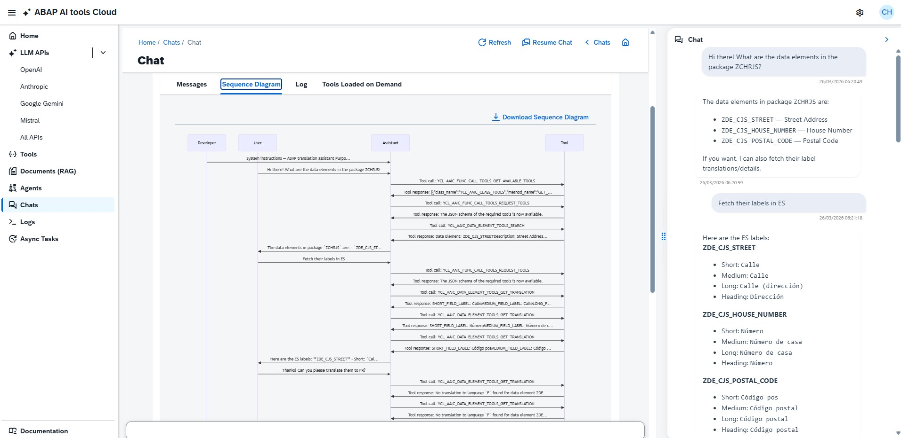

# How to Create and Test AI Agents in the ABAP AI tools Cockpit

This guide explains the practical workflow for creating and testing AI Agents in the ABAP AI tools Cockpit.

## What the Cockpit Covers

The cockpit organizes agent work into these areas:

- `LLM APIs`: maintain provider endpoints and registered models
- `Tools`: register ABAP class methods that agents can call
- `Documents (RAG)`: upload markdown files for system instructions, tools documentation, additional context, etc
- `Agents`: create and configure the agent itself
- `Chats`: test agents and inspect messages, tool calls, sequence diagrams and logs
- `Logs`: review system-wide log messages
- `Async Tasks`: monitor background execution status

Typical flow:

1. Configure an LLM API and its models.
2. Configure the tools the agent will use.
3. Upload markdown documents for instructions and context.
4. Create the agent record.
5. Assign tools, documents, and one or more models to the agent.
6. Test the agent from the integrated chat.
7. Review the resulting chat, logs, and async task execution.

## 1. Configure LLM APIs

Open one of the entries under `LLM APIs` in the left navigation, for example `OpenAI`, `Anthropic`, `Google Gemini`, or `Mistral`.

You can maintain:

- `Base URL`
- the list of available models
- the default model for that provider

Use this step first so the agent model assignment can later suggest valid model names.

## 2. Configure Tools

Open `Tools` to manage the function-calling tools available to agents.

Each tool represents an ABAP class method. The tool configuration has the following fields:

- `Class Name`
- `Method Name`
- `Proxy Class`
- `Description`

Use `Add` to configure a new tool. Use `Assign to Agent` if you want to select one or more existing tools and attach them directly to an agent from the tools screen.

Recommendation:

- Keep descriptions task-oriented so the LLM can choose the correct tool.
- Assign to the agent only the tools it really needs.
- Use a `Proxy Class` when your ABAP implementation requires data type conversions that the LLM may not handle reliably on its own. 

> A `Proxy Class` method typically has the same parameters as the concrete method, but uses generic types such as strings. The proxy class performs the necessary data type conversions first, and then calls the concrete method.

## 3. Upload Documents for Instructions and RAG (Retrieval-Augmented Generation)

Open `Documents (RAG)` to upload markdown files.

The upload dialog supports:

- `Description`
- `Keywords`
- `File`

The file uploader only accepts `.md` (markdown) files.

Three document types are especially relevant for agents:

- `System instructions`: define the agent’s role and behavior
- `Tool usage guides`: explain how the agent should use available tools
- `RAG/context`: provide supporting knowledge the model should reference during execution

Practical guidance:

- Put stable behavioral rules in the system-instructions document.
- Put explicit instructions for tool invocation in the tool usage guide, including when to use each tool, required inputs, expected outputs, and concrete examples.
- Put domain knowledge, reference content, or business facts in the RAG document.

## 4. Create the Agent

Open `Agents` and choose `Add`.

The create dialog requires only:

- `Name`
- `Description`

After the agent is created, open it from the list to complete the configuration.

## 5. Complete the Agent Configuration

The agent detail page is the main configuration screen.

The `Agent Info` section includes:

- `Id`
- `Name`
- `Description`
- `File System Instructions`
- `File Context (RAG)`
- `Prompt Template`

Choose `Edit` to enable changes, then populate the fields you need and save.

### Assign tools

In the `Tools` table, use `Add` to attach registered tools to the agent.

The table shows:

- `Class Name`
- `Method Name`
- `Proxy Class`
- `Description`
- `Load on Demand`

`Load on Demand` is useful when you do not want every tool to be exposed immediately. The agent can then load tools only when needed, and those loaded tools later appear in the chat analysis screen. To enable this functionality, assign the tools `YCL_AAI_FUNC_CALL_TOOLS GET_AVAILABLE_TOOLS` and `YCL_AAI_FUNC_CALL_TOOLS REQUEST_TOOLS`. This allows the agent to retrieve the list of available tools and request the specific tools it needs.
These two tools must not be configured for on-demand loading. They need to be immediately available to the agent. 

### Assign documents

In the `Documents` section, use `Add` to attach additional RAG documents to the agent.

These documents expand the agent’s access to supporting knowledge. This functionality requires assignment of the tools `YCL_AAI_RAG_TOOLS GET_LIST_OF_DOCUMENTS` and `YCL_AAI_RAG_TOOLS GET_DOCUMENTATION`. This allows the agent to retrieve the list of available documents and request the specific documents it needs. These two tools must not be configured for on-demand loading. They need to be immediately available to the agent. 

### Assign models

In the `Models` section, use `Add` to define which provider/model combinations the agent can run with.

The model dialog supports:

- `API`
- `Model`
- `Temperature` for non-OpenAI providers
- `Verbosity` (OpenAI only)
- `Reasoning Effort` (OpenAI only)
- `Max Tool Calls`

## 6. Test the Agent from the Integrated Chat

From the agent detail page:

1. Open the side chat panel on the right.
2. Select the API.
3. Provide the API key.
4. Copy the agent ID and paste it in the `Agent ID` field.
5. Enter your prompt.
6. Choose `Send`.

Testing advice:

- Start with a simple prompt that checks whether the system instructions are being followed.
- Then try prompts that should trigger one or more assigned tools.
- If the agent should use RAG, ask a question that depends on the uploaded markdown content.
- Start testing with the most capable LLM model available to validate feasibility, correctness, and agent design. Once the tests succeed, progressively evaluate less capable models to understand performance trade-offs, cost constraints, and system robustness.

## 7. Review the Chat Execution

Open `Chats` and select the chat session you want to analyze.

The chat detail page includes these tabs:

- `Messages`
- `Sequence Diagram`
- `Log`
- `Tools Loaded on Demand`

### Messages

The `Messages` tab shows the stored conversation records with sequence number, date, time, token usage, and model.

### Sequence Diagram

The `Sequence Diagram` tab visualizes the interaction between developer instructions, user input, assistant messages, and tool calls. This is one of the most useful screens when validating tool-calling behavior.

It also supports downloading the diagram as an image.

### Log

The `Log` tab shows the technical log trail for the chat execution and is helpful for troubleshooting failures or unexpected behavior.

## 8. Use Logs and Async Tasks for Troubleshooting

If a response is delayed or incomplete, check:

- `Async Tasks` to see whether the background task is still running, finished, or failed
- `Logs` for system-wide messages and errors
- `Messages` for the exact message and tool-calls
