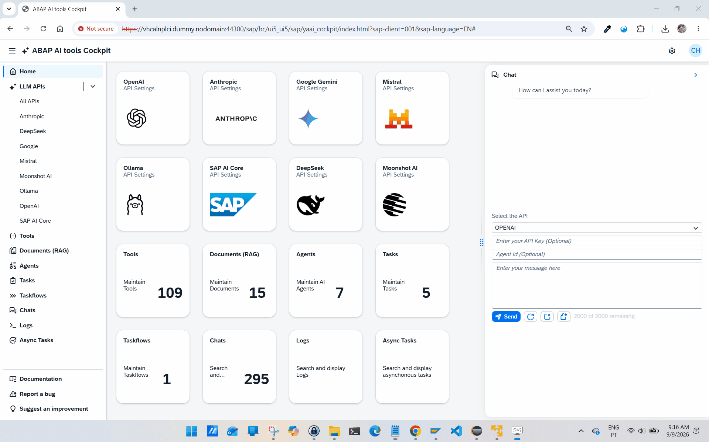
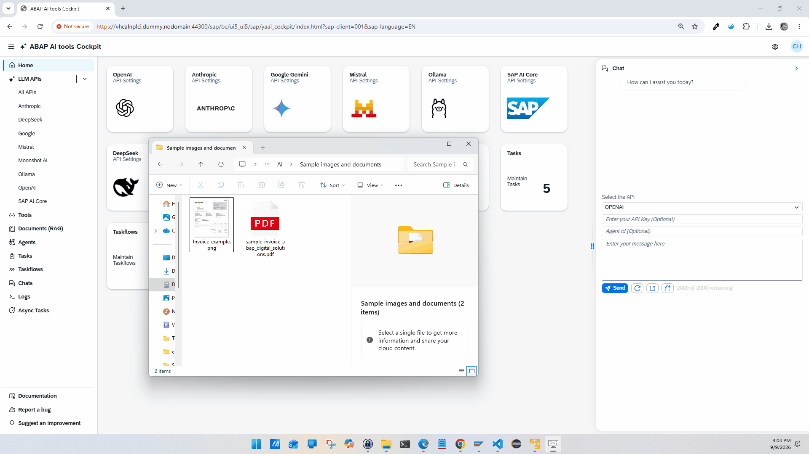
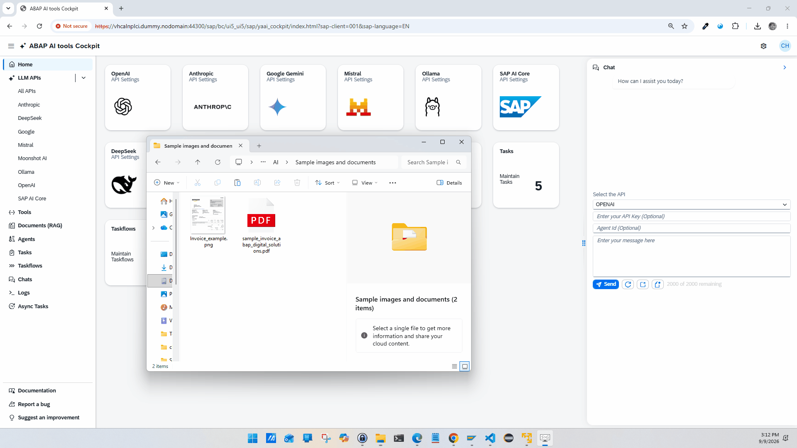
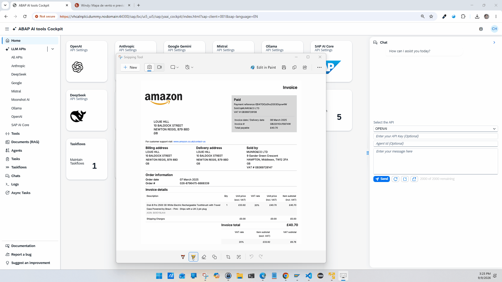

# How to add images and files in the ABAP AI tools Cockpit integrated Chat

The integrated Chat now supports copying and pasting images or files, as well as dragging and dropping images or files directly into the chat prompt text box.

A ghosted preview of the original image or file is added to the conversation, but the image or file is sent only when you submit your prompt.

## Examples

### Paste a screenshot a send it to the LLM along with a prompt

   

### Drag and Drop

   

### Copy and Paste

   

### Copy and Paste Screenshot

   

